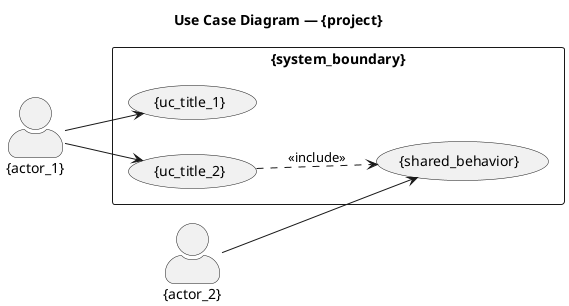
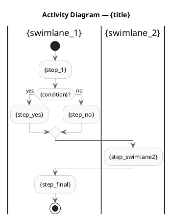
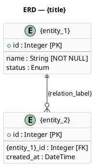

# Шаблоны артефактов — BABOK 7.1 (Specify and Model Requirements)

Этот файл содержит каноничные шаблоны для каждого типа артефакта задачи 7.1.
Используется MCP-сервером `requirements_spec_mcp.py` как эталон структуры.

---

## Шаблон 1: User Story

```
<!-- BABOK 7.1 — User Story | Проект: {project} | {date} -->

# {id} — {title}

**Тип:** User Story
**Проект:** {project}
**Источник:** {source_artifact}
**Приоритет:** {priority}
**Статус:** draft
**Версия:** 1.0

---

## История

As a **{role}**,
I want **{action}**,
So that **{benefit}**.

## Acceptance Criteria

{criteria}

## Дополнительный контекст

{notes}
```

**Правила оформления:**
- `role` — роль пользователя, не персона и не система («Менеджер по заявкам», не «Иван»)
- `action` — конкретное действие, формулируется кратко
- `benefit` — бизнес-результат (не технический), начинается с «я мог» / «система обеспечивала»
- Acceptance Criteria — пронумерованный список, каждый критерий начинается с «Система...» или «Пользователь...»
- Минимум 2, рекомендуется 3–5 критериев

---

## Шаблон 2: Functional Requirement (SRS-style)

```
<!-- BABOK 7.1 — Functional Requirement | Проект: {project} | {date} -->

# {id} — {title}

**Тип:** {req_type}
**Проект:** {project}
**Источник:** {source_artifact}
**Приоритет:** {priority}
**Статус:** draft
**Версия:** 1.0
**Владелец:** {owner}

---

## Формулировка

{description}

## Обоснование

{rationale}

## Ограничения и допущения

{constraints}

## Связанные требования

{related}
```

**Типы требований:**
- `functional` — что система должна делать
- `non_functional` — качественные характеристики (производительность, безопасность, доступность)
- `business_rule` — бизнес-правило или ограничение предметной области

**Правила формулировки:**
- Функциональное: «Система ДОЛЖНА [глагол действия]...»
- Нефункциональное: «Система ДОЛЖНА [метрика] [значение] при [условии]»
- Бизнес-правило: «[Субъект] [глагол] [объект] [условие]» — без слова «система»

---

## Шаблон 3: Use Case

```
<!-- BABOK 7.1 — Use Case | Проект: {project} | {date} -->

# {id} — {title}

**Тип:** Use Case
**Проект:** {project}
**Источник:** {source_artifact}
**Приоритет:** {priority}
**Статус:** draft
**Версия:** 1.0

---

## Общая информация

| Атрибут       | Значение         |
|---------------|------------------|
| Актор (primary) | {primary_actor} |
| Акторы (secondary) | {secondary_actors} |
| Предусловие   | {precondition}   |
| Постусловие   | {postcondition}  |
| Триггер       | {trigger}        |

## Основной сценарий (Happy Path)

{steps_main}

## Альтернативные сценарии

{steps_alt}

## Сценарии исключений

{steps_exc}

## Бизнес-правила и ограничения

{business_rules}
```

**Правила оформления шагов:**
- Нумерованный список: «1. Актор [действие]. 2. Система [реакция].»
- Чередование: актор → система → актор → система
- Исключения: «Xа. Если [условие] → система [действие].»
- Альтернативы нумеруются как «2а», «3б» и т.д. относительно шага основного сценария

---

## Шаблон 4: Use Case Diagram (PlantUML)



**Правила диаграммы:**
- `<<include>>` — обязательное включение (подпроцесс всегда вызывается)
- `<<extend>>` — опциональное расширение (вызывается при условии)
- `<<generalization>>` — наследование акторов (стрела без стрелки, направление к родителю)
- Все UC проекта объединяются на одной диаграмме
- `system_boundary` — имя системы/подсистемы, задаёт прямоугольник

---

## Шаблон 5а: Business Process (текстовое описание)

```
<!-- BABOK 7.1 — Business Process | Проект: {project} | {date} -->

# {id} — {title}

**Тип:** Business Process
**Проект:** {project}
**Источник:** {source_artifact}
**Приоритет:** {priority}
**Статус:** draft
**Версия:** 1.0

---

## Общая информация

| Атрибут     | Значение           |
|-------------|--------------------|
| Владелец процесса | {process_owner} |
| Триггер     | {trigger}          |
| Результат   | {outcome}          |
| Участники   | {participants}     |

## Шаги процесса

{steps}

## Бизнес-правила

{business_rules}

## Метрики процесса

{metrics}

## Исключения и нештатные ситуации

{exceptions}
```

**Правила оформления шагов процесса:**
- Нумерованный список с указанием ответственного: «1. [Роль]: [действие]»
- Точки ветвления: «2a. Если [условие]: → шаг X. 2б. Иначе: → шаг Y.»
- Ожидания/таймеры: «4. [Роль] ожидает [событие] (макс. [время]).»
- Завершение: последний шаг = достижение результата процесса

---

## Шаблон 5б: Business Process Activity Diagram (PlantUML)



**Правила диаграммы:**
- Swimlane для каждого участника/системы (`|имя|`)
- `start` / `stop` — обязательны
- Ромб (`if`) для точек ветвления
- `fork` / `fork again` / `end fork` для параллельных потоков
- Нотация Activity (не BPMN) — PlantUML Activity v2

---

## Шаблон 6а: Data Dictionary

```
<!-- BABOK 7.1 — Data Dictionary | Проект: {project} | {date} -->

# {id} — Data Dictionary: {title}

**Тип:** Data Dictionary
**Проект:** {project}
**Источник:** {source_artifact}
**Статус:** draft
**Версия:** 1.0

---

## Сущность: {entity_name}

**Описание:** {entity_description}

| Атрибут | Тип данных | Обязательный | Ограничения | Описание |
|---------|-----------|--------------|-------------|----------|
| {attr_1} | {type} | Да / Нет | {constraint} | {desc} |

**Бизнес-правила для сущности:**
{entity_rules}

---
```

**Правила оформления:**
- Одна таблица = одна сущность (не смешивать)
- Типы данных: String, Integer, Decimal, Boolean, Date, DateTime, Enum, FK (ссылка)
- Ограничения: NOT NULL, UNIQUE, MIN/MAX, формат (regex), значения по умолчанию
- Enum-атрибуты: перечислить допустимые значения в колонке «Ограничения»

---

## Шаблон 6б: ERD (PlantUML)



**Нотация связей PlantUML:**
- `||--||`  — один к одному (обязательная)
- `||--o|`  — один к одному (необязательная со стороны второй)
- `||--o{`  — один ко многим
- `|o--o{`  — ноль или один ко многим
- `}o--o{`  — многие ко многим

**Правила диаграммы:**
- PK помечается `+` перед атрибутом
- FK отмечать в комментарии `[FK]`
- Разделитель `--` между PK и остальными атрибутами
- Метка связи (`"relation_label"`) — краткий глагол от первой сущности ко второй

---

## Соответствие типов артефактов и типов требований в реестре 5.1

| Артефакт 7.1     | type в реестре 5.1 | ID-префикс |
|------------------|--------------------|------------|
| User Story       | user_story         | US-        |
| Functional Req   | functional         | FR-        |
| Non-Functional   | non_functional     | NFR-       |
| Business Rule    | business_rule      | BR-        |
| Use Case         | use_case           | UC-        |
| Business Process | business_process   | BP-        |
| Data Dictionary  | data_dictionary    | DD-        |
| ERD              | erd                | ERD-       |
