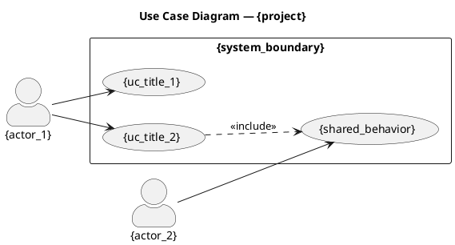
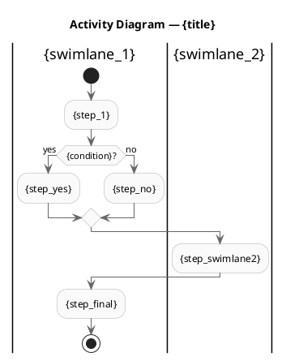
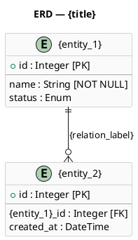

# Artifact Templates — BABOK 7.1 (Specify and Model Requirements)

This file contains the canonical templates for each artifact type of task 7.1.
Used by the `requirements_spec_mcp.py` MCP server as the structural reference.

---

## Template 1: User Story

```
<!-- BABOK 7.1 — User Story | Project: {project} | {date} -->

# {id} — {title}

**Type:** User Story
**Project:** {project}
**Source:** {source_artifact}
**Priority:** {priority}
**Status:** draft
**Version:** 1.0

---

## Story

As a **{role}**,
I want **{action}**,
So that **{benefit}**.

## Acceptance Criteria

{criteria}

## Additional context

{notes}
```

**Formatting rules:**
- `role` — a user role, not a persona and not the system ("Application Manager", not "John")
- `action` — a concrete action, phrased concisely
- `benefit` — a business outcome (not technical), starts with "I can" / "the system ensures"
- Acceptance Criteria — a numbered list, each criterion starts with "The system..." or "The user..."
- Minimum 2, 3–5 criteria recommended

---

## Template 2: Functional Requirement (SRS-style)

```
<!-- BABOK 7.1 — Functional Requirement | Project: {project} | {date} -->

# {id} — {title}

**Type:** {req_type}
**Project:** {project}
**Source:** {source_artifact}
**Priority:** {priority}
**Status:** draft
**Version:** 1.0
**Owner:** {owner}

---

## Statement

{description}

## Rationale

{rationale}

## Constraints and assumptions

{constraints}

## Related requirements

{related}
```

**Requirement types:**
- `functional` — what the system must do
- `non_functional` — quality characteristics (performance, security, availability)
- `business_rule` — a business rule or domain constraint

**Phrasing rules:**
- Functional: "The system SHALL [action verb]..."
- Non-functional: "The system SHALL [metric] [value] under [condition]"
- Business rule: "[Subject] [verb] [object] [condition]" — without the word "system"

---

## Template 3: Use Case

```
<!-- BABOK 7.1 — Use Case | Project: {project} | {date} -->

# {id} — {title}

**Type:** Use Case
**Project:** {project}
**Source:** {source_artifact}
**Priority:** {priority}
**Status:** draft
**Version:** 1.0

---

## General information

| Attribute       | Value         |
|---------------|------------------|
| Actor (primary) | {primary_actor} |
| Actors (secondary) | {secondary_actors} |
| Precondition   | {precondition}   |
| Postcondition   | {postcondition}  |
| Trigger       | {trigger}        |

## Main scenario (Happy Path)

{steps_main}

## Alternative scenarios

{steps_alt}

## Exception scenarios

{steps_exc}

## Business rules and constraints

{business_rules}
```

**Step formatting rules:**
- Numbered list: "1. Actor [action]. 2. System [response]."
- Alternation: actor → system → actor → system
- Exceptions: "Xa. If [condition] → system [action]."
- Alternatives are numbered as "2a", "3b" etc. relative to the main scenario step

---

## Template 4: Use Case Diagram (PlantUML)


```plantuml
@startuml {diagram_name}
left to right direction
skinparam packageStyle rectangle
skinparam actorStyle awesome

title Use Case Diagram — {project}

actor "{actor_1}" as A1
actor "{actor_2}" as A2

rectangle "{system_boundary}" {
    usecase "{uc_title_1}" as UC1
    usecase "{uc_title_2}" as UC2
    usecase "{shared_behavior}" as UC_shared
}

A1 --> UC1
A1 --> UC2
UC2 ..> UC_shared : <<include>>
A2 --> UC_shared

@enduml
```

**Diagram rules:**
- `<<include>>` — mandatory inclusion (the sub-process is always invoked)
- `<<extend>>` — optional extension (invoked under a condition)
- `<<generalization>>` — actor inheritance (arrow without an arrowhead, pointing to the parent)
- All UCs in the project are combined on one diagram
- `system_boundary` — the system/subsystem name, defines the rectangle

---

## Template 5a: Business Process (text description)

```
<!-- BABOK 7.1 — Business Process | Project: {project} | {date} -->

# {id} — {title}

**Type:** Business Process
**Project:** {project}
**Source:** {source_artifact}
**Priority:** {priority}
**Status:** draft
**Version:** 1.0

---

## General information

| Attribute     | Value           |
|-------------|--------------------|
| Process owner | {process_owner} |
| Trigger     | {trigger}          |
| Outcome   | {outcome}          |
| Participants   | {participants}     |

## Process steps

{steps}

## Business rules

{business_rules}

## Process metrics

{metrics}

## Exceptions and edge cases

{exceptions}
```

**Process step formatting rules:**
- Numbered list with the responsible party: "1. [Role]: [action]"
- Branch points: "2a. If [condition]: → step X. 2b. Otherwise: → step Y."
- Waits/timers: "4. [Role] waits for [event] (max [time])."
- Completion: the last step = the process outcome is reached

---

## Template 5b: Business Process Activity Diagram (PlantUML)


```plantuml
@startuml {diagram_name}
skinparam activityArrowColor #666666
skinparam activityBackgroundColor #FAFAFA
skinparam activityBorderColor #AAAAAA
skinparam backgroundColor #FFFFFF

title Activity Diagram — {title}

|{swimlane_1}|
start

:{step_1};

if ({condition}?) then (yes)
  :{step_yes};
else (no)
  :{step_no};
endif

|{swimlane_2}|
:{step_swimlane2};

|{swimlane_1}|
:{step_final};

stop
@enduml
```

**Diagram rules:**
- A swimlane for each participant/system (`|name|`)
- `start` / `stop` — mandatory
- Diamond (`if`) for branch points
- `fork` / `fork again` / `end fork` for parallel flows
- Activity notation (not BPMN) — PlantUML Activity v2

---

## Template 6a: Data Dictionary

```
<!-- BABOK 7.1 — Data Dictionary | Project: {project} | {date} -->

# {id} — Data Dictionary: {title}

**Type:** Data Dictionary
**Project:** {project}
**Source:** {source_artifact}
**Status:** draft
**Version:** 1.0

---

## Entity: {entity_name}

**Description:** {entity_description}

| Attribute | Data type | Required | Constraints | Description |
|---------|-----------|--------------|-------------|----------|
| {attr_1} | {type} | Yes / No | {constraint} | {desc} |

**Business rules for the entity:**
{entity_rules}

---
```

**Formatting rules:**
- One table = one entity (do not mix)
- Data types: String, Integer, Decimal, Boolean, Date, DateTime, Enum, FK (reference)
- Constraints: NOT NULL, UNIQUE, MIN/MAX, format (regex), default values
- Enum attributes: list the allowed values in the "Constraints" column

---

## Template 6b: ERD (PlantUML)


```plantuml
@startuml {diagram_name}
!define TABLE(name,desc) class name as "desc" << (T,#FFAAAA) >>
hide methods
hide stereotypes

skinparam classBackgroundColor #FAFAFA
skinparam classBorderColor #AAAAAA

title ERD — {title}

entity "{entity_1}" as E1 {
  + id : Integer [PK]
  --
  name : String [NOT NULL]
  status : Enum
}

entity "{entity_2}" as E2 {
  + id : Integer [PK]
  --
  {entity_1}_id : Integer [FK]
  created_at : DateTime
}

E1 ||--o{ E2 : "{relation_label}"

@enduml
```

**PlantUML relationship notation:**
- `||--||`  — one-to-one (mandatory)
- `||--o|`  — one-to-one (optional on the second side)
- `||--o{`  — one-to-many
- `|o--o{`  — zero-or-one-to-many
- `}o--o{`  — many-to-many

**Diagram rules:**
- PK is marked with `+` before the attribute
- Mark FK with the `[FK]` comment
- Separator `--` between the PK and the remaining attributes
- The relationship label (`"relation_label"`) — a short verb from the first entity to the second

---

## Mapping of artifact types to requirement types in the 5.1 registry

| 7.1 Artifact     | type in 5.1 registry | ID prefix |
|------------------|--------------------|------------|
| User Story       | user_story         | US-        |
| Functional Req   | functional         | FR-        |
| Non-Functional   | non_functional     | NFR-       |
| Business Rule    | business_rule      | BR-        |
| Use Case         | use_case           | UC-        |
| Business Process | business_process   | BP-        |
| Data Dictionary  | data_dictionary    | DD-        |
| ERD              | erd                | ERD-       |
